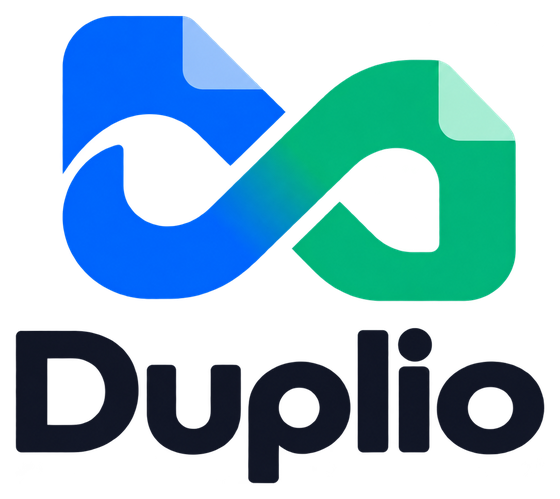

<p align="center">
  <picture>
    <source media="(prefers-color-scheme: dark)" srcset="branding/logo-dark.png">
    
  </picture>
</p>

# Duplio

Программа для Windows, которая находит одинаковые файлы — фото, видео, музыку, документы — во всех
вложенных папках, показывает копии рядом с превью и отправляет лишние в Корзину.

**[Скачать установщик](https://github.com/stimgaklike/Duplio/releases/latest)** · Windows 10/11, 64 бит ·
ставится без прав администратора · обновляется сама

*English: Duplio finds identical files (photos, videos, music, documents) across all subfolders, shows the copies
side by side with previews and moves the extra ones to the Recycle Bin. The interface is available in English
(Settings → Language).*

## Что умеет

- **Точные копии**, а не «похожие»: одинаковое содержимое байт в байт, имена могут быть любыми.
- **Результаты сразу**: группы копий появляются по мере нахождения, самые «тяжёлые» — первыми;
  удалять можно, не дожидаясь конца поиска.
- **Сравнение**: все копии группы рядом с превью (у видео — кадр), быстрый просмотр по пробелу.
- **Видно, сколько осталось**: шаг, скорость, оставшееся время — в окне и в заголовке на панели задач.
- **Типы файлов на выбор**: фото, видео, музыка, документы и книги, архивы, остальные.
- **Нагрузка на выбор**: бережно (не мешает другим программам), обычно (для HDD), быстро (для SSD).
- **Трей**: крестик спрашивает — свернуть к часам (поиск продолжается) или закрыть; можно запомнить выбор.
  По окончании поиска в трее — уведомление.
- **Светлая и тёмная тема, русский и английский язык.**
- **Обновления**: программа сама узнаёт о новой версии и ставит её по одной кнопке.

## Безопасность

- В каждой группе одна копия остаётся всегда — отметить все нельзя.
- Удаление только **в Корзину**; где Корзины нет (флешка, сеть), Windows спросит отдельно.
- Перед удалением проверяется, что файл не изменился после поиска и что оставляемая копия на месте.
- Жёсткая ссылка (тот же файл под вторым именем) копией не считается.
- Файлы «только в облаке» (OneDrive) и файлы телефона из «Связи с телефоном» не читаются —
  иначе Windows начала бы их скачивать.
- Системные файлы Windows и папки `$RECYCLE.BIN`, `System Volume Information` не трогаются.

## Что программа хранит

- Настройки — `%APPDATA%\Duplio\settings.json` (меньше 1 КБ).
- Журнал работы для разбора ошибок — `%LOCALAPPDATA%\Duplio\logs`, не больше 3 МБ, никуда не отправляется.
- Больше ничего: превью живут в памяти. При удалении программы через «Приложения» уходит и это.
- В сеть программа обращается только к GitHub — узнать, есть ли новая версия (можно выключить).

## Как ищет

1. Обходит папки и группирует файлы по размеру.
2. У файлов одинакового размера сравнивает начало и конец (по 64 КБ).
3. Совпавшие сверяет целиком по хешу BLAKE2b.

Целиком читаются только файлы, которые действительно могут быть копиями, поэтому большие диски
проверяются быстро: 513 ГБ на внешнем жёстком диске — около получаса, упираясь в скорость самого диска.

## Разработка

```
pip install pyside6 pyinstaller
python app.py                          # запуск из исходников
python -m unittest discover -s tests   # тесты логики, обновлений, журнала
python tests/e2e_app.py                # прогон окна целиком (+ снимки экрана)
python tests/e2e_english.py            # английский интерфейс без единой русской строки
python tests/bench_resize.py           # плавность при растягивании окна
build.bat                              # программа в dist\Duplio и установщик dist\Duplio-Setup-<версия>.exe
```

Для `build.bat` нужен [Inno Setup 6](https://jrsoftware.org/isinfo.php).

**Выпуск версии**: поставить метку `vX.Y.Z` и отправить её на GitHub — сборка на GitHub Actions прогонит тесты,
соберёт установщик и опубликует релиз; установленные программы увидят обновление.

| Файл | Что внутри |
|---|---|
| `dupcore.py` | поиск, правила «что оставить», проверки перед удалением, Корзина |
| `app.py` | главное окно, трей, обновления, второй запуск |
| `dups_page.py` | вкладка «Дубликаты»: список, сравнение, быстрый просмотр |
| `settings_page.py`, `compress_page.py` | остальные вкладки |
| `thumbs.py` | превью фото и кадры из видео в фоне |
| `updater.py` | проверка, скачивание и установка обновлений |
| `i18n.py` | русский и английский |
| `logs.py` | журнал работы |
| `theme.py`, `icons/` | оформление, светлая и тёмная тема |
| `installer.iss` | установщик (Inno Setup) |

## План и история

[ROADMAP.md](ROADMAP.md) — что дальше (следующий этап — сжатие фото и видео), [CHANGELOG.md](CHANGELOG.md) — что менялось.

## Лицензия

[MIT](LICENSE) — пользуйся, меняй, распространяй; сохраняй упоминание автора.
